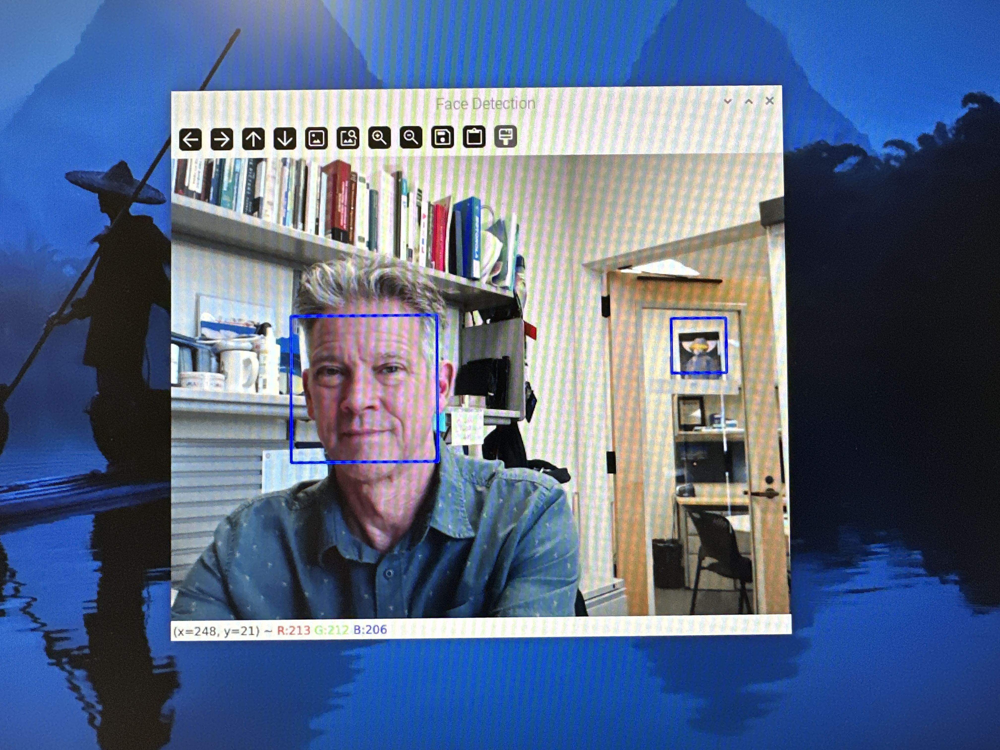

README.md
==========

*Face Detection on the Raspberry Pi* is a simple interactive demonstration of computer-based image recognition. It was originally developed in early 2024 for presentation at the [Southern California Linux Expo](https://socallinuxexpo.org) *The Next Generation* event in Pasadena, California.

Organization
============

This repository includes:

* this README.md file
* `bin/` - contains the `face_detection.py` program
* `docs/` - contains references, including an OpenDocument text (ODT) file that can be used in presenting the demonstration, and an inventory of items to bring for sharing the demo
* `img/` - contains some photos/screenshots of the demo

Setup
=====

This particular version of the demonstration was run on a Raspberry Pi 4B running Raspbian with a USB mouse, USB keyboard, and USB webcam attached. The demonstration will run on other POSIX platforms (macOS, Linux on Windows), perhaps with some modifications for webcam drivers as needed.

Software installation
---------------------

From the Terminal in the home directory:

1. Update the Raspberry Pi
    ```
    $ sudo apt update && sudo apt upgrade -y
    ```
2. Create a virtual Python environmnet in which to install the software
    ```
    $ python -m venv ~/venv
    ```

3. Start the virtual environment
    ```
    $ source ~/venv/bin/activate
    ```
    Optional step: modify `.bashrc` to include this same line so that the virtual environment is launched every time a Terminal window is opened.

4. Install `pip3` Python package manager (may already be installed)
    ```
    $ sudo apt install python3-pip
    ```

5. Download and install the opencv module (will take a few minutes, depending on connection speed)   
    ```
    $ pip3 install opencv-python
    ```

6. Optional step: Install `xscreensaver`, which can be used to disable the screen sleeping. This can be useful when presenting at a booth for hours at a time.
    ```
    $ sudo apt install xscreensaver
    ```
    Once installed, launch the app and use the graphical interface to disable the screensaver.

Running the demonstration
-------------------------

1. Put the `face_detection.py` file on the Desktop of the Raspberry Pi
2. Open a Terminal and run the command
    ```
    $ python ~/Desktop/face_detection.py
    ```


3. The environment may allow the window to be resized. If possible, expand the window so that demo viewers are able to better see the face recognition analysis.
4. Ask viewers to tilt their head to one side, or to obscure part of their face with hair or a mask. Does the face recognition still work?
5. Does the program work on faces in a darkened room? Does it work on faces with darker complexions?
6. Are there any features in the camera's view that the algorithm mistakenly identifies as faces? Why might that be?
7. Use the 30x Zoom feature in the window to display the Red-Green-Blue values of each pixel. Note that algorithms don't "know" what a face looks like. They see patterns of numbers, and things that are "faces" generally have a certain pattern of numbers that an algorithm can identify.


Licenses
=======

* Handout - CC-by-4.0
* Software - MIT


References
==========

* [*Computer Vision with Raspberry Pi](https://www.oreilly.com/content/raspberry-pi-cookbook-computer-vision/), Monk, S. 2016. O'Reilly. Retrieved 2025-03-11.
